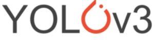
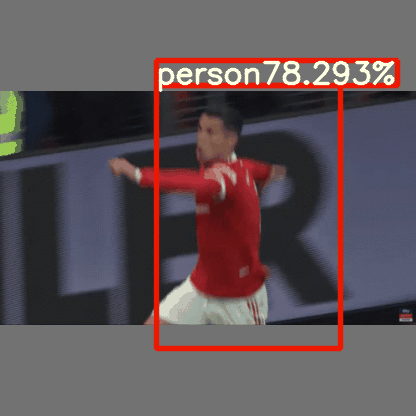
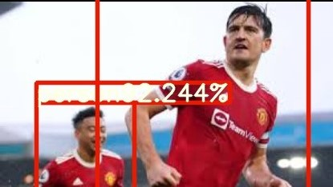
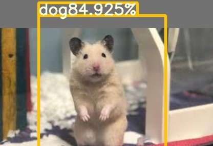
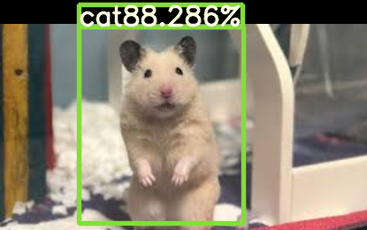
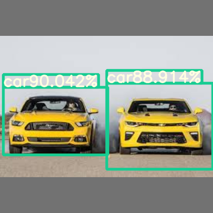

# YOLOv3 from scratch

This is the mid-term project for DATA130051 Computer Vision. 🐮🐮🐮



YOLOv3 🚀 is an open-source object detection architecture first proposed by Joseph Redmon[[1](https://pjreddie.com/)]. I managed to reproduce the network from scratch with the help of Aladdin Persson[[2](https://github.com/aladdinpersson/)] and his excellent video tutorials[[3](https://www.youtube.com/watch?v=Grir6TZbc1M)]. 🤳 Basically, I reimplemented YOLOv3 model as well as the utils and metrics for detections. Also, a detector class was written to provide a shortcut for video detections. Again, thanks a lot for those who contribute to this open-source society! 🤗

### Quick Start 🌟

#### Install 😎

[Python>=3.6.0](https://www.python.org/) is required with all [requirements.txt](./requirements.txt) installed including [PyTorch>=1.9.0](https://pytorch.org/get-started/locally/):

```bash
git clone https://github.com/super-dainiu/yolov3
cd yolov3
pip install -r requirements.txt
```

#### Download weights 🤪

Please follow the guide in [./pretrained](./pretrained) directory.

#### Download dataset 🥵

Please follow the guide in [./PASCAL_VOC](./PASCAL_VOC) directory. Again credit to Aladdin Persson[[2](https://github.com/aladdinpersson/)] for his excellent tutorial. 👍

#### Inference 👾

After downloading the weights, you can do detection for images, gifs, or mp4 using [main.py](main.py).

>usage: main.py [-h] --weights WEIGHTS [--save SAVE] [--save_dir SAVE_DIR] [--conf_thres CONF_THRES] [--iou_thres IOU_THRES] [--max_det MAX_DET] [--target TARGET [TARGET ...]]
>          [--camera CAMERA] [--samples SAMPLES [SAMPLES ...]]
>
>Use YOLOv3
>
>optional arguments:
>
>-h, --help            show this help message and exit
>
>--weights WEIGHTS     Weight directory
>
>--save SAVE           Save results
>
>--save_dir SAVE_DIR   Save directory
>
>--conf_thres CONF_THRES
>                   Confidence threshold
>
>--iou_thres IOU_THRES
>                   IOU threshold
>
>--max_det MAX_DET     Maximum detection per frame
>
>--target TARGET [TARGET ...]
>                   Targets (i.e. person), * for all classes
>
>--camera CAMERA       Use your camera
>
>--samples SAMPLES [SAMPLES ...]
>                   Sample images (ends with .jpg, .png, .gif, .mp4)

You might do a simple detection with the following bash command.

```bash
python main.py --weights pretrained/yolov3.pth.tar --sample samples/video.mp4 samples/image_1.jpg samples/image_2.png samples/gif_1.gif --save True --save-dir outputs --target person car --conf_thres 0.7 --iou_thres 0.3 --max_det 10
```

Or activate your camera for detection.

```bash
python main.py --weights pretrained/yolov3.pth.tar --camera True
```

### Results 🙀

#### PASCAL VOC metrics (mAP at .5 IOU) 🌟

| Class         | mAP    |
| ------------- | ------ |
| aeroplane     | 58.018 |
| bicycle       | 60.933 |
| bird          | 34.835 |
| boat          | 32.412 |
| bottle        | 17.423 |
| bus           | 63.038 |
| car           | 69.853 |
| cat           | 57.547 |
| chair         | 29.547 |
| cow           | 44.667 |
| diningtable   | 48.446 |
| dog           | 48.934 |
| horse         | 59.299 |
| motorbike     | 63.281 |
| person        | 52.751 |
| pottedplant   | 19.121 |
| sheep         | 48.951 |
| sofa          | 51.492 |
| train         | 56.918 |
| tvmonitor     | 55.288 |
| **TOTAL mAP** | 48.638 |

#### Example Outputs 💩

<details open>
<summary>Transformer</summary>
    
</details>

<details open>
<summary>CR7 Celebration</summary>
    
</details>

<details open>
<summary>Maguire and Lingod</summary>
    
</details>
<details open>
<summary>The dog</summary>
    
</details>
<details open>
<summary>The cat</summary>
    
</details>

<details open>
<summary>Car</summary>
    
</details>
